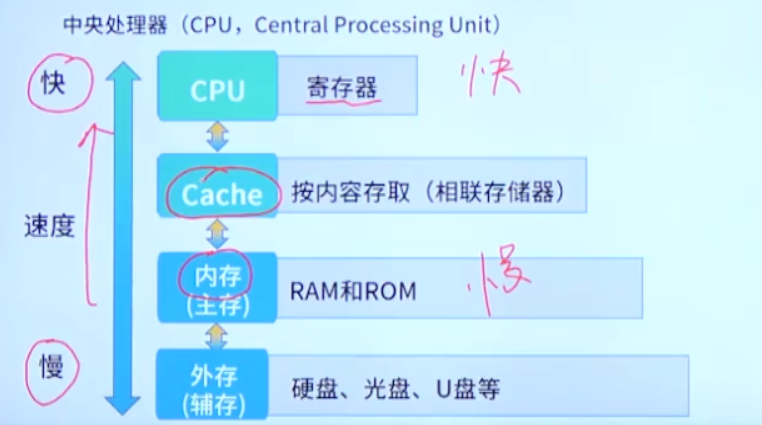

# 考点总览

3-4分

# 数据的表示

## 进制表示

### 进制的互相转换计算

二进制和十进制转换的问题，之后计算ip会用到，随便找个图

## 原码，反码和补码

表示有符号数据的编码方式

## 逻辑运算

# 计算机体系结构

## 冯诺依曼体系结构

运算器，控制器，存储器，输入设备和输出设备

### 控制器

### 运算器

常考：

## 计算机总线

### 考法：计算机总线的分类

# 指令系统基础

## 指令的组成

操作码+地址码

## 寻址方式

获得操作数的方法，采用多种寻址方式，实现扩大寻址空间并提高编程灵活性的目的

### 常见的寻址方式

1. 立即寻址（常考）
2. 变址寻址
3. 直接寻址
4. 间接寻址
5. 寄存器寻址
6. 寄存器间接寻址

2，3，4为内存中的寻址

### 考法：寻址方式的特点

### 考法2：多种寻址方式的目的

扩大寻址空间并提高编程灵活性

## 指令系统类型

两种指令集系统

一个偏向于用户编程，一个偏向于机器执行的高效性

### 考法：CISC和RISC的对比

## Flynn分类

注意这个只有理论存在的MISD就行，其他不考

## 流水线技术

CPU执行指令的方式，操作系统中学过。

### 计算要求

- 流水线周期：哪个最长哪个就是周期
- 流水线的时间计算

### 流水线技术指标

- 吞吐率
- 加速比
- 效率

### 相关术语

### 考法：流水线计算

# 存储系统

## 多级存储结构

采用多级存储结构的目的：解决容量，成本，速度之间的矛盾问题

### cache缓存——主存层次

### 主存——辅存层次

### 考法：多级存储的目的

考法：两个层次

## 主存

### 考法：主存的组成和闪存

### 考法：计算主存容量

存储单位的转换

例题：主存容量的计算

### 考法：存储芯片的计算

`芯片数=主存总容量/单个存储芯片容量`

## Cache

和主存的映射关系，三个相连映射模式

1. 直接相连映射
2. 全相联映射
3. 组相联映射

### Cache命中率

### Cache淘汰算法

- 先进先出算法
- 最近最少算法
- 随机算法

### 考法：Cache的作用和地址映射

## 硬盘

## 存储系统的存取方式

### 各类存储器的存取方式

# 系统可靠性

## 可靠性指标

相关指标：

- 失效率

- 平均无故障时间 MTBF

- 平均故障修复时间 MTTR

- 可用性

## 可靠性计算

