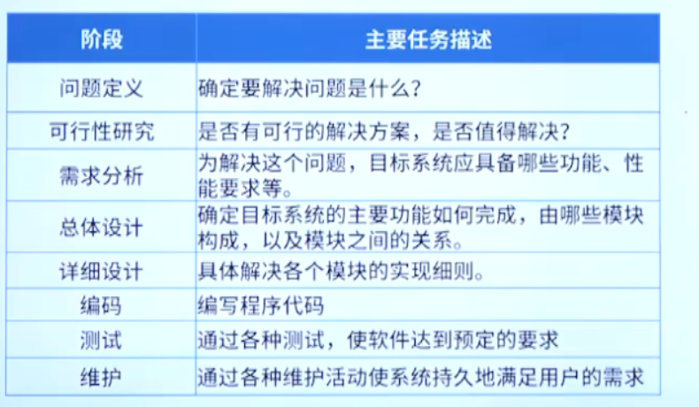

# 考点简介

tnnd，在逗我

常识性知识点

# 软件生命周期和开发模型

## 软件生命周期

对各个阶段的解释

### 考法1：软件生命周期的各阶段任务

总体设计也写作概要设计

## 软件开发模型

### 考法1：开发模型适用项目的总结

# 软件开发与测试

## 软件设计

软件系统的标准：高内聚，低耦合

## 程序编码

难蚌

## 软件测试

考法：

难蚌

# 项目管理基础

## 时间管理

### 常用图形描述方法

Gannett图

PERT图（考试核心）

### PERT图相关概念

### 考法1:特点

### 考法2：相关时间的计算

例题1：

松弛时间：关键路径-包含那一段活动的最长徒径

例题2：

