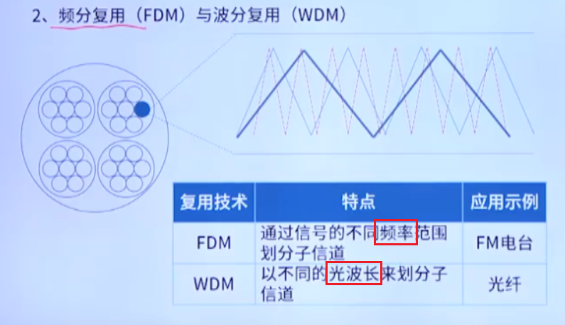
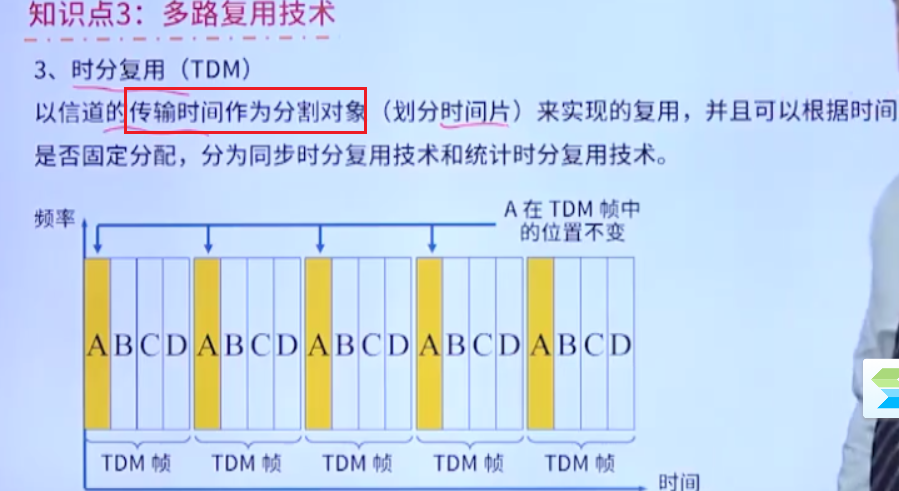
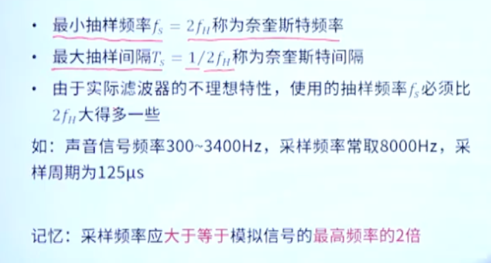
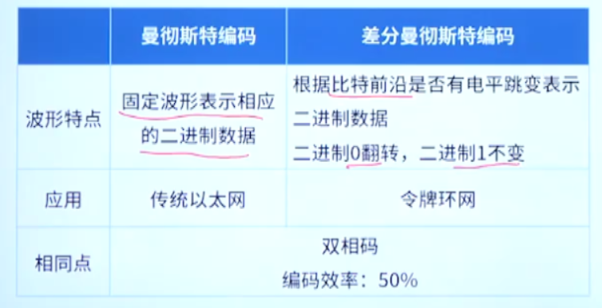

# 考点总览

考试分值分布

# 通信系统概述

## 通信系统基本概念

### 什么是通信

通信是发送者和接收者之间通过某种媒体的信息传递

### 模拟信号和数字信号

### 码元

单位是波特，码元速率

## 通信系统组成

### 基本组成

调制：数字信号=》模拟信号

解调：模拟信号=》数字信号

## 多路复用技术

把多个低速信道组成一条高速信道的技术，可以有提高数据链路的利用率

### 不同的复用技术

#### 空分复用

#### 频分复用和波分复用

#### 时分复用

同步时分复用

E1载波：欧洲，我们国家再用

T1载波：美国日本

> 

其他的同步时分复用

#### 码分复用

### 考法1：各种复用技术区分

### 考法2：E1/T1载波

## 通信方式

# 信道特征

## 通信系统的性能指标

一个是速度问题，还有一个是质量问题

## 信道容量计算

几个公式，分为理想信道和有噪声信道

DB怎么换算:arrow_double_up:

### 考法1：容量计算公式的应用

例题：

有信噪比就用香农定理

## 编码与调制

## 数字调制技术

模拟信道/数字信道，数模转换

数字调制

### 考法1：各种调制技术的特点

例题：

主要还是和奈奎斯特定理结合比较多，这里建议把公式写在内裤上

### 考法2：调制技术波形判断

## PCM脉冲编码调制技术

解决模拟信号在数字信道中传输问题

模拟信号——》数字信号

PCM分为采样，量化，编码三步

几个需要掌握的概念

### 考法1：PCM的相关要点

## 数字编码与编码效率

### 基本编码

### 应用型编码

### 编码效率

### 考法1：曼彻斯特编码和差分曼彻斯特编码规则

例题：

先通过差分判断后面的，再通过曼彻斯特编码判断第一个

### 考法2：应用环境的编码方案与效率判别

## 差错控制

