# 考点预览

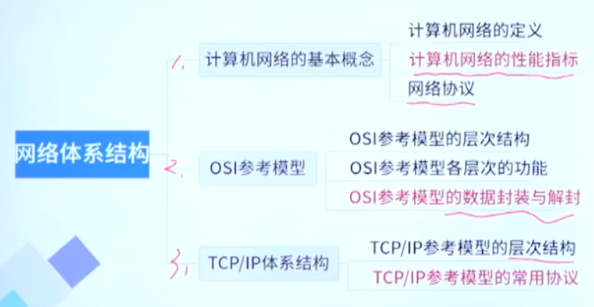

分值分布

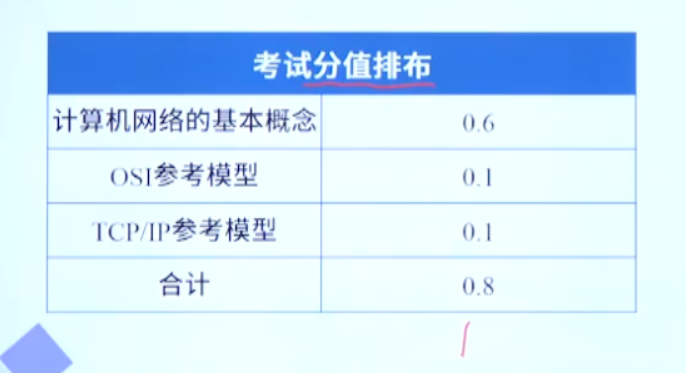

nmmp，1分？

# 计算机网络的基本概念

## 计算机网络定义

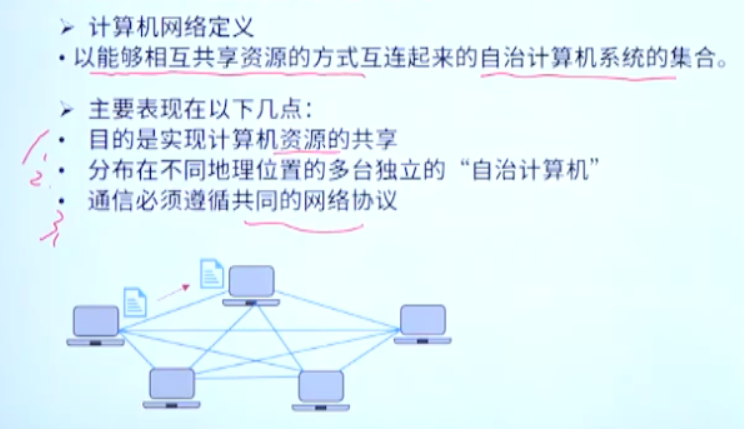

## 计算机网络性能指标

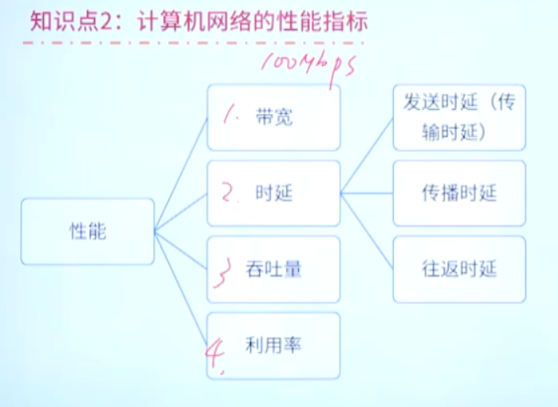

### 带宽

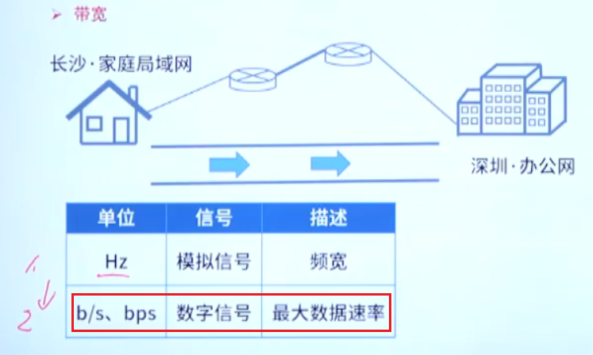

### 时延

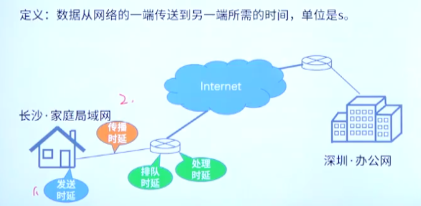

四种时延

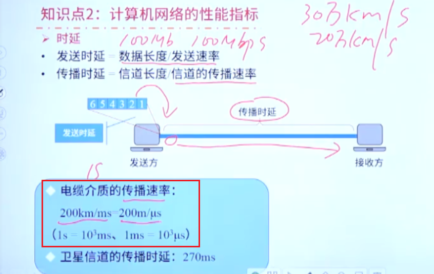

电缆的速度需要记住

例题：

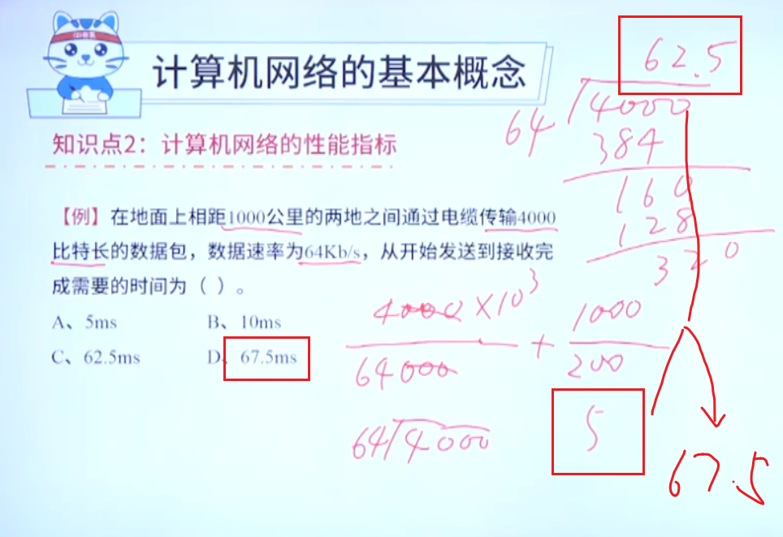

### 时延计算

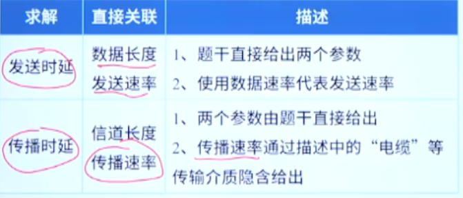

# OSI参考模型

## 网络协议

语法，时序，语义，协议的三大要素

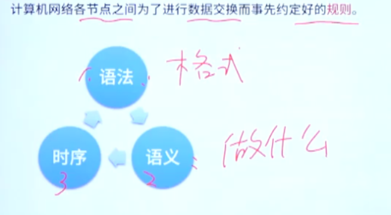

## OSI参考模型层次结构

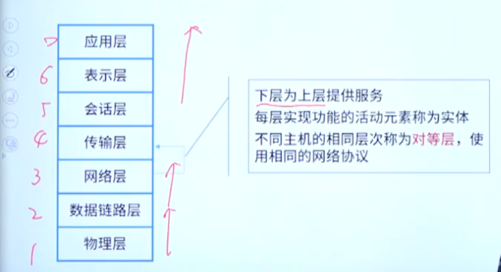

## 各层功能定义

### 应用层

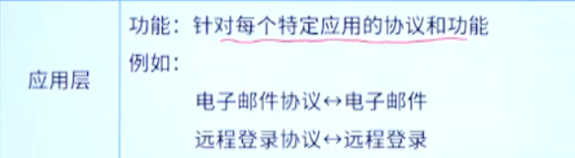

### 表示层

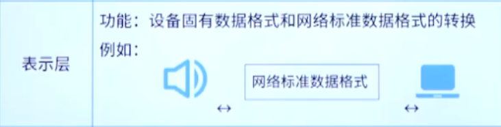

### 会话层

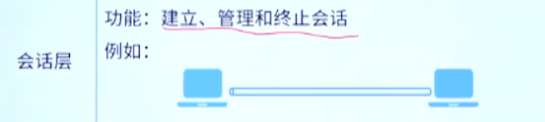

### 传输层

两个应用之间的通信，端到端

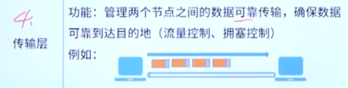

### 网络层

主机到主机的通信

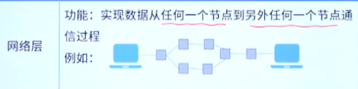

### 数据链路层

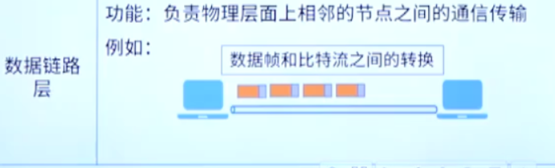

### 物理层

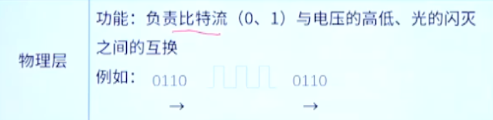

### 总结

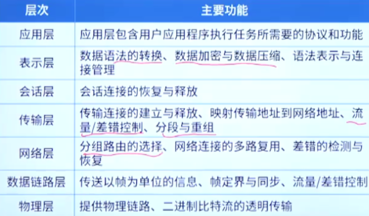

## 各层发送的数据单位及设备

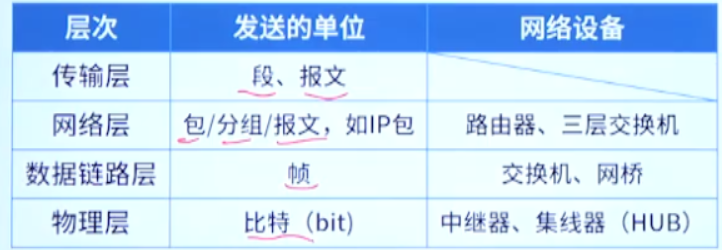

## OSI参考模型数据的封装

封装和解封装

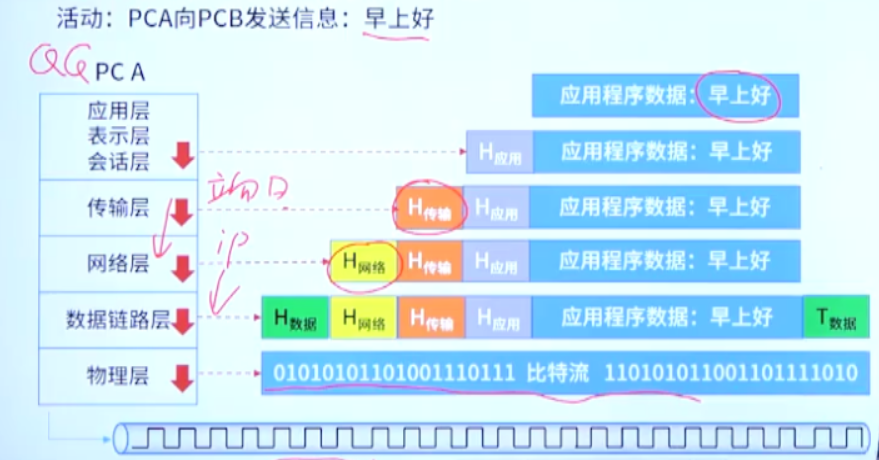

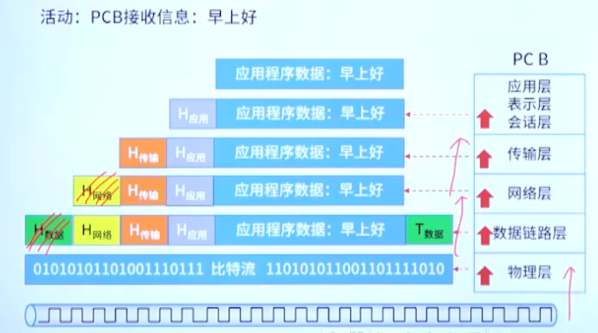

### 层与层之间的关系

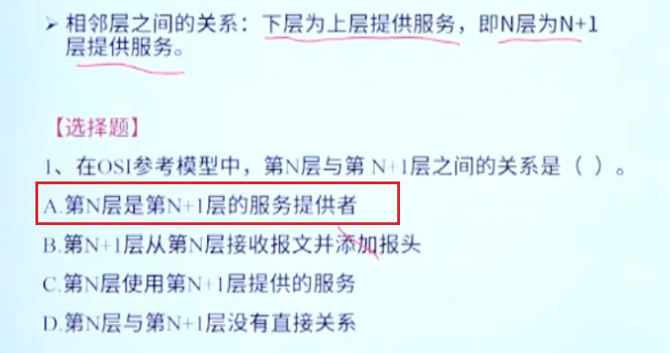

# TCP/IP参考模型

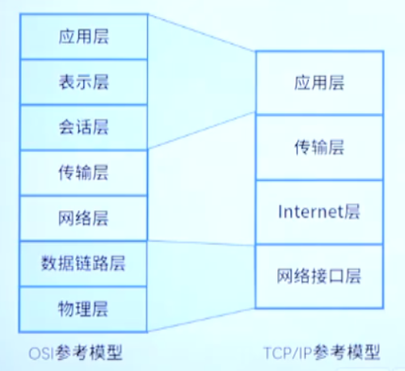

## TCP/IP常用协议

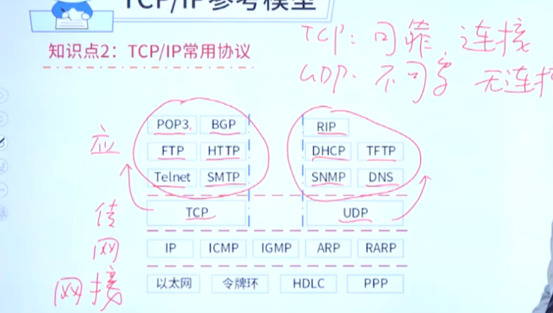

几个常用协议的大致功能：

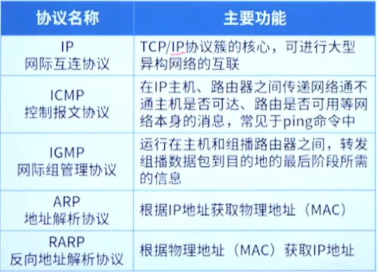

TCP和UDP

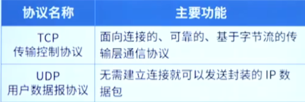

其他常用协议，记住就完事了

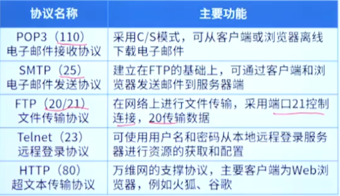

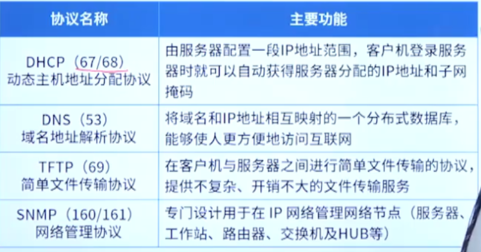

几个路由协议

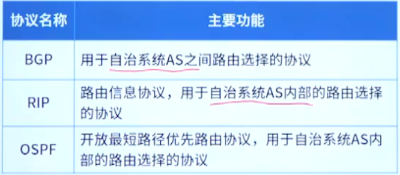

### 考法1：各层协议及功能

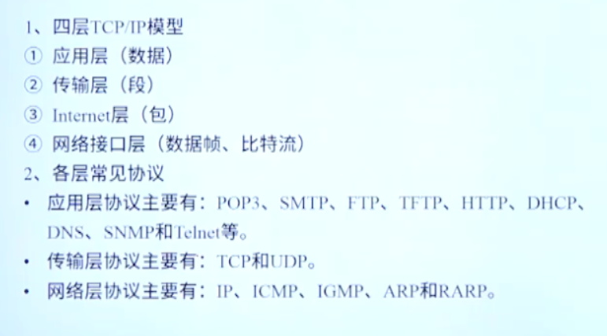

